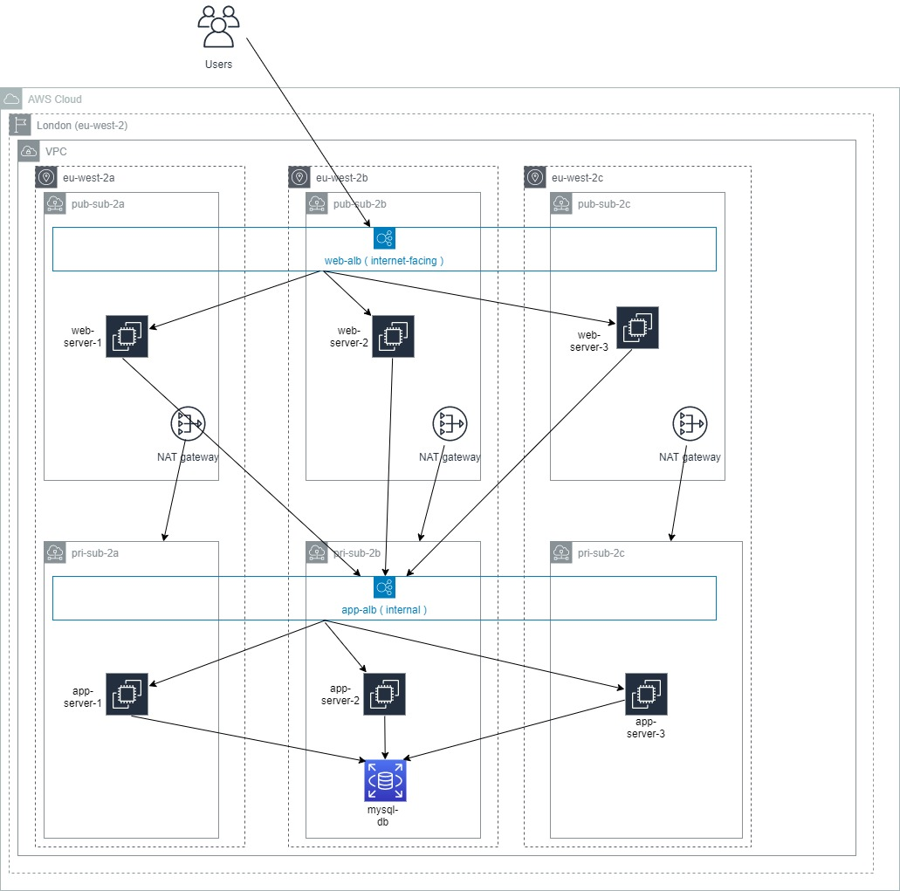

Terraform Project
==================

This repository contains the terraform code for creating a three tier architecture
- web
- app
- db

Navigate into ```terraform-infra``` folder to provision the resources

> [!NOTE]
> The code has been written and completely tested in the below versions
> - Terraform version = 1.5.5
> - AWS Provider version = 5.10.0

# Architecture Digram

